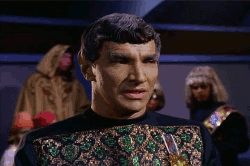

theme: Sketchnote, 4

# Round 1 Answers

---

# Who is Mr. Spocks father?

## Sarek

---

# When did the Apple iPhone first become available in 2005, 2006 or 2007?

## 2007

---

# True or false? Gold is not a good conductor of electricity?

## False

---

# What science fiction writer wrote the three laws of robotics?

## Isaac Asimov

---

# True or false? DNA is an abbreviation for ‘Deoxyribonucleic acid’.

## True

---

# Along with whom did Bill Gates found Microsoft?

## Paul Allen

---

# IBM is a well known computer and information technology company, what does IBM stand for?

## International Business Machines

---

# The technologically advanced humanoid robot ASIMO is made by which car company?

## Honda

---

# This penguin character is the mascot of Linux Kernel. Name this penguin?

## Penguin

---

# What does WaSP stand for?

## The Web Standards Project

