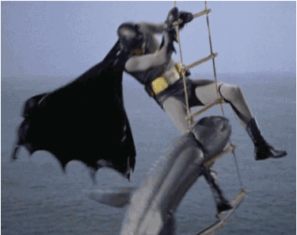
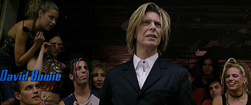
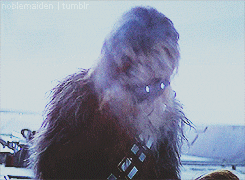

theme: Sketchnote, 4

# Round 1 Answers

---

# This penguin character is the mascot of Linux Kernel. Name this penguin?

## Penguin

---

# What does the Smartduvet do?

## Automatically makes your bed

---

# When did the Apple iPhone first become available in 2005, 2006 or 2007?

## 2007

---

# True or false? Gold is not a good conductor of electricity?

## False

---

# What do the TV series Batman and Star Trek have in common in 2016?

## Both celebrated their 50th anniversary

---

# Along with whom did Bill Gates found Microsoft?

## Paul Allen

---

# Who judged the “walk off” in the movie Zoolander?

## David Bowie

---

# IBM is a well known computer and information technology company, what does IBM stand for?

## International Business Machines

---

# Name the animals sounds combined to create Chewbacca’s voice

## A bear, a walrus, a lion and a badger.

---

# The technologically advanced humanoid robot ASIMO is made by which car company?

## Honda

