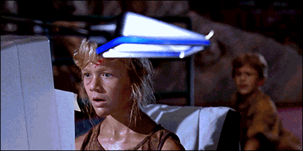

theme: Sketchnote, 4

# Round 2 Answers

---

# What is the worst case complexity of Timsort in Big O Notation? Who is it Named After?

## O(n log n) & Tim Peters

---

## Mary's mum has four children. The first child is called April. The second May. The third June. What is the name of the fourth child?

### Mary

---

# Name the animals sounds combined to create Chewbacca’s voice

## A bear, a walrus, a lion and a badger.

---

## Name the utility that automatically builds the executable and libraries from source code which was originally created by Stuart Feldman in 1997 at Bell Labs?

### Make

---

# What is the latest Android OS name? Bonus: And the latest version number?

## Nougat & 7.0

---

# Which company developed the IRIX computer operating system?

## SGI

---

# When was Nintendo established and what did they make?

## 1889 & Playing cards

---

# A crystal anniversary celebrates how many years?

## 15

---

# Name the second longest river in Ireland?

## Barrow

---

# Who judged the “walk off” in the movie Zoolander?

## David Bowie

