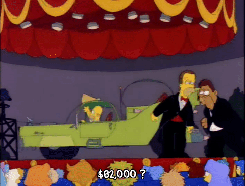
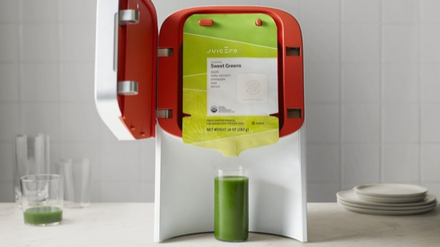
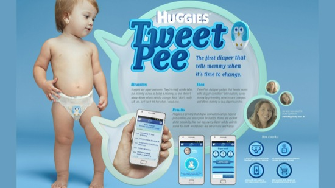
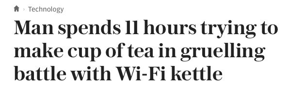

theme: Sketchnote, 4

# Round 3 Answers

---

# What is Homer Simpson's brother's name?

## Herb Powell

---

# What does the Juicero do? How much does it cost?

## It's a $700 DRM'd juicing machine

---

# What does the Smartduvet do?

## Automatically makes your bed

---

# What does the Flosstime do?

## It's a smart floss dispenser

---

# What does the Huggies TweetPee do?

## Exactly what you feared

---

# How Long did it take Mark Rittman to make a cup of tea with his new kettle?

## 11 hours

---

# What is notable about the Mirai botnet attack on 21st October?

## The scale and the large number of IoT devices used, mostly web cameras

---

# Complete this line: "Never gonna give you up, "

# " never gonna let you down"

---

## Gordon Moore, Vinton Cerf and Robert Khan have previously received the US Presidential Medal of Freedom for their contributions to computing. Can you name the two recipients this year?

### Margaret Hamilton & Grace Hopper

---

# Why is Ben Affleck sad?

### During an interview with Affleck and Cavill for Batman vs Superman, the interviewer asked them how they feel about the mixed to negative reviews from critics the film has received so far. Cavill then took the lead in answering the question while Affleck remained in silence with a noticeably sad look on his face.

