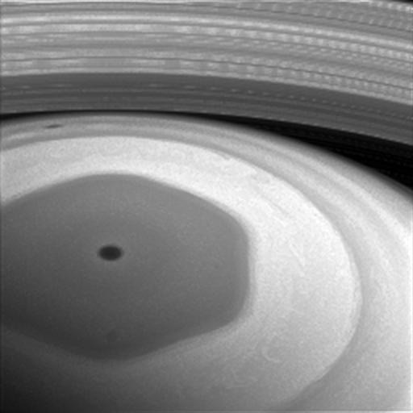

theme: Sketchnote, 4

# Round 3 Answers

---

# What is Homer Simpson's brother's name?

## Herb Powell

---

# True or false? DNA is an abbreviation for ‘Deoxyribonucleic acid’.

## True

---

# What does the TweetPee do?

## Exactly what you feared

---

# Who is Mr. Spocks father?

## Sarek

---

# How Long did it take Mark Rittman to make a cup of tea with his new kettle?

## 11 hours

---

# Complete this line: "Never gonna give you up, "

# " never gonna let you down"

---

# What science fiction writer wrote the three laws of robotics?

## Isaac Asimov

---

## Gordon Moore, Vinton Cerf and Robert Khan have previously received the US Presidential Medal of Freedom for their contributions to computing. Can you name the two recipients this year?

### Margaret Hamilton & Grace Hopper

---

# Why is Ben Affleck sad?

### During an interview with Affleck and Cavill for Batman vs Superman, the interviewer asked them how they feel about the mixed to negative reviews from critics the film has received so far. Cavill then took the lead in answering the question while Affleck remained in silence with a noticeably sad look on his face.

---

## The space probe Cassini started sending back pictures of Saturn. What is notable about the cloud formation at the north pole of Saturn?

### It’s hexagon shape

