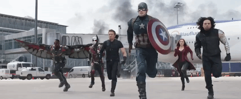
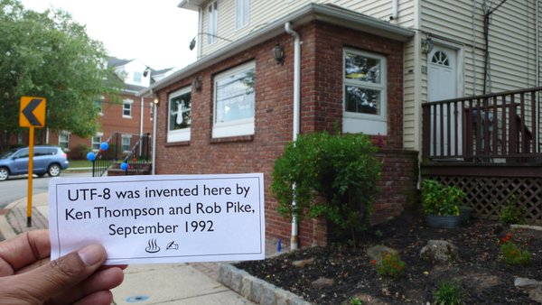

theme: Sketchnote, 4

# Round 4 Answers

---

# Name the second longest river in Ireland?

## Barrow

---

# What does PPAP stand for?

## Pen-Pineapple-Apple-Pen

---

# In July of this year the final what was made by Japanese manufacturer Funai?

## Video cassette recorder

---

# What is #Mannequinchallenge?

## The Mannequin Challenge is a viral Internet video trend where people remain frozen in action like mannequins while a moving camera films them.

---

# Who does Millie Bobby Brown play in the TV series Stranger Things?

## Eleven

---

# What was the highest grossing film of 2016 (so far)

## Captain America: Civil War

---

# What was invented in a New Jersey diner by Rob Pike and Ken Thompson?

## UTF-8 on a placemat

---

# What game was Norway’s Prime Minister, Erna Solberg, caught playing in parliament?

## Pokémon GO

---

# Samsung recently pushed out an unusual software update for one of their phones, what does it do?

## Update for the 🔥🚨Galaxy Note 7🚨🔥, completely disabling the phone

---

# In the game Overwatch, what is the characer Mei’s blaster do?

## Mei’s blaster unleashes a concentrated, short-range stream of frost that damages, slows, and ultimately freezes enemies in place.

